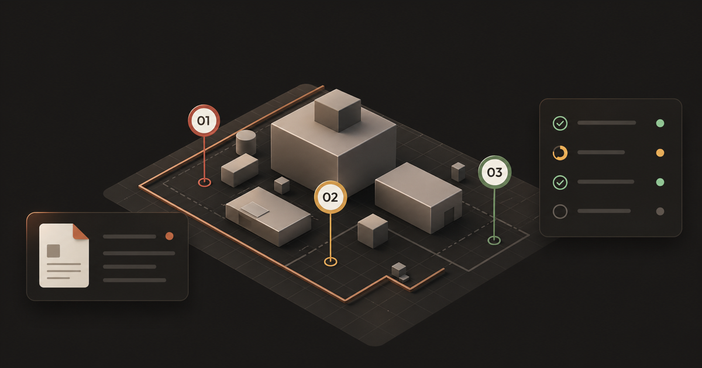

<div align="center">

<br>


<br>

# ResolveScope

**ResolveScope is an AI-assisted evidence review case management platform for insurance claims, fleet safety incidents, site inspections, and quality workflows**: turning scattered evidence into structured, reviewable case files for the Handshake x OpenAI Codex Creator Challenge.

### AI-assisted evidence review infrastructure for claims, safety, inspections, and quality workflows.

<p>
Structured case files. Reviewable decisions. Stakeholder-ready reports.<br>
Built with OpenAI Codex for the Handshake x OpenAI Codex Creator Challenge and for operational teams that cannot afford to get evidence review wrong.
</p>

<br>

<a href="https://resolvescope.pages.dev"><strong>→ resolvescope.pages.dev: live demo, no login required</strong></a>

<br>


<br><br>



<br><br>

ResolveScope is an open-source product demo for the Handshake x OpenAI Codex Creator Challenge. It shows how OpenAI Codex can help shape an evidence-to-action workflow that turns documents, photos, notes, and spatial observations into structured, reviewable case files.

<br>

---

<p><em>Built as an entry for the <strong>Handshake x OpenAI Codex Creator Challenge</strong> (2026)<br>
Developed with OpenAI Codex as the primary implementation agent, guided by <code>AGENTS.md</code> as the operating contract.</em></p>

---

<br>

</div>

## Live Demo

**[https://resolvescope.pages.dev](https://resolvescope.pages.dev)** - deployed on Cloudflare Pages, no login required.

<br>

<div align="center">

| Demo surface | What you'll see |
|:---|:---|
| [**ResolveScope landing page**](https://resolvescope.pages.dev/) | Product framing, evidence-to-action workflow, and challenge overview |
| [**Case management dashboard**](https://resolvescope.pages.dev/dashboard) | Seeded cases by status, priority, and workflow type |
| [**Auto claim evidence workspace**](https://resolvescope.pages.dev/demo/auto-claim) | Insurance claim review with evidence, AI extraction, and spatial context |
| [**Fleet safety incident workspace**](https://resolvescope.pages.dev/demo/fleet-safety) | Fleet incident review and operational handoff flow |
| [**Site inspection spatial review**](https://resolvescope.pages.dev/demo/site-inspection) | Field observations, inspection evidence, and spatial annotation |
| [**Consumer quality complaint workspace**](https://resolvescope.pages.dev/demo/consumer-quality) | Product quality review and consumer-care triage |
| [**Compliance audit review workspace**](https://resolvescope.pages.dev/demo/compliance-audit) | Governed intake, review, and decision-support workflow |
| [**Auto claim stakeholder report**](https://resolvescope.pages.dev/report/auto-claim) | Formatted case brief for external insurance claim review |
| [**Fleet safety stakeholder report**](https://resolvescope.pages.dev/report/fleet-safety) | Fleet safety report for incident-to-action handoffs |
| [**Site inspection stakeholder report**](https://resolvescope.pages.dev/report/site-inspection) | Inspection report for punch lists and physical asset review |
| [**Consumer quality stakeholder report**](https://resolvescope.pages.dev/report/consumer-quality) | Quality complaint report for product and support teams |
| [**Compliance audit stakeholder report**](https://resolvescope.pages.dev/report/compliance-audit) | Audit report for structured review and approval |
| [**ResolveScope architecture page**](https://resolvescope.pages.dev/architecture) | System design, data model, and Cloudflare infrastructure direction |

</div>

<br>

> **Note:** The frontend demo is live. Current demo surfaces run on fictional seeded frontend data. There are no live AI calls in the deployed demo. The Workers API, D1, R2, Queues, and Durable Objects layers are part of the architectural direction; not yet deployed.

---

## Suggested Reviewer Flow

Six stops. Start to finish in under ten minutes.

<br>

**Step 1 → [Landing page](https://resolvescope.pages.dev/)**
Product framing, problem statement, and the core workflow at a glance.

**Step 2 → [Case dashboard](https://resolvescope.pages.dev/dashboard)**
The operational view. Browse seeded cases across types, statuses, and priorities.

**Step 3 → [Auto claim workspace](https://resolvescope.pages.dev/demo/auto-claim)**
Open a case. Review evidence, structured seeded extraction, and spatial annotation side by side.

**Step 4 → [Stakeholder report](https://resolvescope.pages.dev/report/auto-claim)**
The output. An export-ready case brief formatted for external review.

**Step 5 → [Quality and audit demos](https://resolvescope.pages.dev/dashboard)**
Scan the two newer workflows: consumer quality complaint and compliance audit review.

**Step 6 → [Architecture page](https://resolvescope.pages.dev/architecture)**
The system behind it. Data model, infrastructure direction, and design decisions.

---

## Handshake x OpenAI Codex Creator Challenge

ResolveScope is a sponsor-facing submission for the 2026 Handshake x OpenAI Codex Creator Challenge. The project uses OpenAI Codex as the primary build agent and documents how agent instructions, scoped skills, and review loops shaped the implementation.

The challenge demo focuses on a credible product slice: structured evidence intake, AI-assisted extraction, human review, spatial annotation, and export-ready reports. It is intentionally scoped as a polished frontend demo with seeded data, not as a production claims, safety, or compliance system.

---

## What ResolveScope Is

Operational teams face the same failure mode repeatedly:

> **Important decisions get made from scattered, unstructured evidence.**

The evidence exists (photos, documents, notes, field observations, video), but it lives in email threads, shared drives, and chat. No single record. No clear approval. No audit trail.

ResolveScope is the evidence-to-action case management workspace that fixes this. Every piece of evidence flows into a structured, reviewable, exportable case file. The demo uses seeded AI-assisted extraction to show the workflow shape. Humans approve before anything becomes final.

The core loop is the same regardless of domain:

**Structured intake → assisted extraction → human review → export.**

The template layer makes it adaptable without making it generic.

---

## Who It Is For

- **Insurance claims teams** reviewing photos, documents, statements, and severity signals
- **Fleet safety and operations teams** turning incidents into accountable follow-up actions
- **Site inspection and engineering teams** documenting field observations, punch lists, and spatial evidence
- **Quality and consumer-care teams** triaging product complaints and visual evidence
- **Governed review teams** that need structured intake, approval trails, and stakeholder-ready exports

---

## Why It Matters

<div align="center">

| Common approach | The problem | ResolveScope |
|:---|:---|:---|
| Email threads and shared drives | Evidence is scattered, untraceable | Centralized case workspace with linked evidence |
| Manual report writing | Slow, inconsistent, error-prone | AI-assisted extraction and structured field generation |
| Static forms | Rigid intake, no AI leverage | Template-driven workflows with AI extraction and review |
| Flat image review | No spatial context | 360° and spatial annotation built into the review surface |
| One-shot AI summaries | Hard to trust, impossible to verify | Review, edits, approvals, and provenance for every AI output |
| Point tools per workflow | Fragmented handoffs | Single evidence-to-action platform across multiple domains |

</div>

---

## Product Surfaces

- **Evidence intake**: documents, images, video, and field notes into a unified case workspace
- **AI-assisted extraction workflow**: structured fields, timeline construction, summaries, and draft actions shown with seeded demo data
- **Human-in-the-loop review**: every AI output is reviewable and editable before it becomes final
- **Spatial and 360° annotation**: inspectable scenes with evidence pins for field and inspection workflows
- **Stakeholder-ready outputs**: formatted case briefs and shareable report views
- **Template-driven workflows**: the same surface adapts across claims, safety, inspections, and quality review

---

## Documentation

<div align="center">

<table>
<tr>
<th align="left" width="200">Document</th>
<th align="left">Description</th>
</tr>
<tr>
<td><a href="docs/architecture.md"><strong>Architecture</strong></a></td>
<td>System overview, evidence lifecycle, data model, Cloudflare-native infrastructure direction, and current vs. directional implementation status.</td>
</tr>
<tr>
<td><a href="docs/how-it-works.md"><strong>How it works</strong></a></td>
<td>End-to-end flow from intake through extraction, review, spatial annotation, and export. How the seeded demos map to the product story.</td>
</tr>
<tr>
<td><a href="docs/how-i-built-this.md"><strong>How I built this</strong></a></td>
<td>Implementation overview, shaping decisions, tradeoffs, what was scoped out, and where the architecture is real vs. directional.</td>
</tr>
<tr>
<td><a href="docs/prompting-guide.md"><strong>Prompting guide</strong></a></td>
<td>How this repo uses <code>AGENTS.md</code> as an agent operating contract, how tasks are sliced for Codex, token-efficiency tactics, and prompt patterns.</td>
</tr>
<tr>
<td><a href="docs/demo-surfaces.md"><strong>Demo surfaces</strong></a></td>
<td>What each demo surface shows, what it demonstrates, and what it is not claiming. Reference for reviewers navigating the live demo.</td>
</tr>
<tr>
<td><a href="docs/screenshots.md"><strong>Screenshots</strong></a></td>
<td>Capture checklist, recommended viewports, and guidance for adding screenshots to the repo.</td>
</tr>
<tr>
<td><a href="docs/how-to-use-skills.md"><strong>How to use skills</strong></a></td>
<td>How agent skills are discovered, installed, and invoked in this repo; when to let them trigger naturally vs. when to force them explicitly.</td>
</tr>
<tr>
<td><a href="WORKFLOW.md"><strong>Workflow</strong></a></td>
<td>Why agent instructions and skills are committed, what local state is excluded, and how to reproduce the workflow safely.</td>
</tr>
<tr>
<td><a href="CONTRIBUTING.md"><strong>Contributing</strong></a></td>
<td>Local setup, validation expectations, and contribution guidelines.</td>
</tr>
<tr>
<td><a href="SECURITY.md"><strong>Security</strong></a></td>
<td>How to report vulnerabilities and what is out of scope for the seeded demo.</td>
</tr>
<tr>
<td><a href="NOTICE.md"><strong>Notice</strong></a></td>
<td>Attribution notes for third-party assets, generated demo evidence, and committed workflow skills.</td>
</tr>
</table>

</div>

---

## Local Setup

```bash
npm install
npm run dev:web     # start the frontend dev server
npm run typecheck   # type check
npm run build       # build all workspaces
```

Requires Node.js 20+ and npm 10+.

---

## Deployment

The React 19 and TypeScript frontend is live at **[resolvescope.pages.dev](https://resolvescope.pages.dev)** on Cloudflare Pages.

The Workers API, D1, R2, Queues, and Durable Objects layers are part of the architectural direction. Current demo surfaces run on seeded frontend data.

No live AI provider is required to run the current app.

---

## License

[MIT](./LICENSE)
