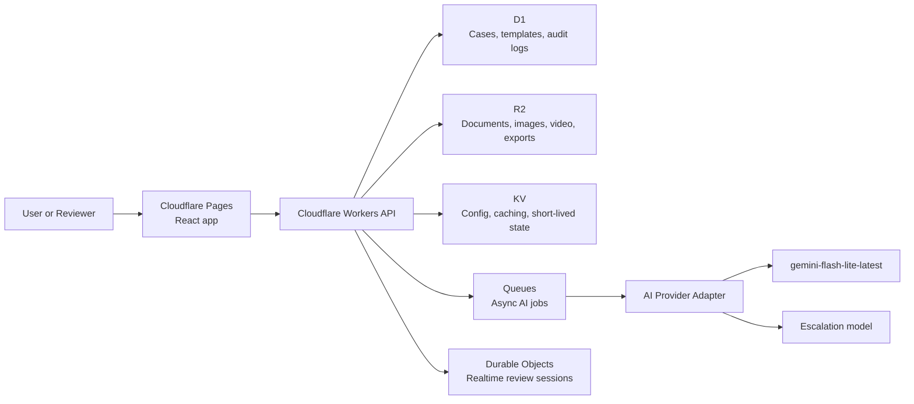

<div align="center">

<br>

# ResolveScope

### Evidence-to-action infrastructure for claims, safety, inspections, and quality workflows.

<p>Structured case files. Reviewable decisions. Stakeholder-ready reports.<br>Built for the operational teams that can't afford to get it wrong.</p>

<br>

**[→ resolvescope.pages.dev](https://resolvescope.pages.dev)**

<br>


<br><br>

</div>

---

## Live demo

**[https://resolvescope.pages.dev](https://resolvescope.pages.dev)** — deployed on Cloudflare Pages, no login required.

| Route | Surface |
|---|---|
| [`/`](https://resolvescope.pages.dev/) | Landing page — product framing and workflow overview |
| [`/dashboard`](https://resolvescope.pages.dev/dashboard) | Case dashboard — seeded case list with status, priority, and type |
| [`/demo/auto-claim`](https://resolvescope.pages.dev/demo/auto-claim) | Auto claim workspace — evidence intake, AI extraction, spatial review |
| [`/demo/fleet-safety`](https://resolvescope.pages.dev/demo/fleet-safety) | Fleet safety incident workspace |
| [`/demo/site-inspection`](https://resolvescope.pages.dev/demo/site-inspection) | Site inspection workspace — field observations, findings, annotations |
| [`/report/auto-claim`](https://resolvescope.pages.dev/report/auto-claim) | Stakeholder report — formatted case brief for external review |
| [`/report/fleet-safety`](https://resolvescope.pages.dev/report/fleet-safety) | Fleet safety stakeholder report |
| [`/report/site-inspection`](https://resolvescope.pages.dev/report/site-inspection) | Site inspection stakeholder report |
| [`/architecture`](https://resolvescope.pages.dev/architecture) | Architecture overview — system design, data model, stack decisions |

---

## Suggested reviewer flow

Five stops that show the full product story, end to end.

**1. [Landing page](https://resolvescope.pages.dev/)** — product framing, problem statement, and the workflow at a glance.

**2. [Case dashboard](https://resolvescope.pages.dev/dashboard)** — the operational view. Browse seeded cases across types, statuses, and priorities.

**3. [Auto claim workspace](https://resolvescope.pages.dev/demo/auto-claim)** — open a case. Review evidence, structured AI extraction, and spatial annotation side by side.

**4. [Stakeholder report](https://resolvescope.pages.dev/report/auto-claim)** — the output. An export-ready case brief generated from the same data, formatted for external review.

**5. [Architecture page](https://resolvescope.pages.dev/architecture)** — the system behind it. Data model, infrastructure direction, and design decisions.

---

## Why ResolveScope

Operational teams face the same failure mode repeatedly:

> **Important decisions get made from scattered, unstructured evidence.**

The evidence exists — photos, documents, notes, field observations, video — but it lives in email threads, shared drives, and chat. There's no single record. No clear approval. No audit trail.

That creates predictable downstream problems:

- Evidence is hard to find and easy to lose
- Handoffs between submitters and reviewers are slow and error-prone
- Reports are written manually, from memory, inconsistently
- Decisions are hard to defend when the supporting evidence isn't linked
- Spatial context — where on a vehicle, a site, a product — is lost entirely

ResolveScope is the case-centered workspace that fixes this. Every piece of evidence flows into a structured, reviewable, exportable case file. AI assists with extraction and summarization. Humans approve before anything becomes final.

---

## What makes it different

| Common approach | The problem | ResolveScope |
|---|---|---|
| Email threads and shared drives | Evidence is scattered and untraceable | Centralized case workspace with linked, versioned evidence |
| Manual report writing | Slow, inconsistent, error-prone | AI-assisted extraction and structured field generation |
| Static forms | Rigid intake, no AI leverage | Template-driven workflows with AI extraction and review |
| Flat image review | No spatial context | 360° and spatial annotation built into the review surface |
| One-shot AI summaries | Hard to trust, impossible to verify | Review, edits, approvals, and provenance for every AI output |
| Point tools per workflow | Fragmented handoffs across systems | Single evidence-to-action platform across multiple domains |

The core loop is the same regardless of domain: **structured intake → AI extraction → human review → export.** The template layer makes it adaptable without making it generic.

---

## Demo workflows

Three seeded templates that demonstrate the platform across distinct operational domains.

**Auto Claim Review**
Vehicle damage evidence, severity triage, and claim-ready report generation. Demonstrates evidence linking, AI extraction into structured fields, and export output formatted for external stakeholders.

**Fleet Safety Incident**
Driver incident intake, evidence review, and escalation workflow. Demonstrates multi-stage handoff, structured timeline construction, and safety-oriented report generation.

**Site Inspection**
Field observations, photo annotations, and punch list generation. Demonstrates spatial annotation, physical asset review, and remediation summary output.

---

## Product surfaces

A single platform with a consistent evidence-to-action loop across every workflow:

- **Evidence intake** — documents, images, video, and field notes into a unified case workspace
- **AI-assisted extraction** — structured fields, timeline construction, summaries, and draft actions
- **Human-in-the-loop review** — every AI output is reviewable and editable before it becomes final
- **Spatial and 360° annotation** — inspectable scenes with evidence pins and zone markers for field and inspection workflows
- **Stakeholder-ready outputs** — formatted case briefs, JSON bundles, and shareable read-only report views
- **Template-driven workflows** — the same product surface adapts across claims, safety, inspections, and quality review

---

## Architecture

The system is designed around a clear separation between raw evidence, structured outputs, and audit history. The frontend demo runs on seeded data; the infrastructure layer below is the architectural direction.



See the [architecture page](https://resolvescope.pages.dev/architecture) for the full system overview, data model, and design rationale.

---

## Stack

**Frontend**
- React 19 + TypeScript — strict mode throughout
- React Router v7 — file-based routing
- Custom CSS — no utility framework, deliberate design system
- React Three Fiber / Three.js — 360° and spatial annotation surfaces

**Platform (architectural direction)**
- Cloudflare Pages — frontend hosting, live at `resolvescope.pages.dev`
- Cloudflare Workers — API layer
- Cloudflare D1 — relational case and audit data
- Cloudflare R2 — document, image, and video storage
- Cloudflare Queues — async AI job processing
- Cloudflare Durable Objects — realtime coordinated review sessions

**AI**
- `gemini-flash-lite-latest` as the default extraction and summarization model
- Provider-agnostic adapter layer designed for model swapping and cost routing
- Escalation path available for higher-complexity review tasks

**Tooling**
- npm workspaces monorepo
- Vite
- Wrangler

---

## Local setup

```bash
# Install dependencies
npm install

# Start the frontend
npm run dev:web

# Type check
npm run typecheck

# Build all workspaces
npm run build
```

Requires Node.js 20+ and npm 10+.

---

## Deployment

The frontend is live at **[resolvescope.pages.dev](https://resolvescope.pages.dev)** on Cloudflare Pages.

The Workers API, D1, R2, Queues, and Durable Objects layers are part of the architectural direction. The current demo surfaces run on seeded frontend data.

---

## Product principles

- **Evidence first** — raw evidence stays visible and linked, never hidden behind AI output
- **Human approval required** — important outputs remain reviewable and editable before finalization
- **Structured by default** — summaries are useful, but structured fields drive action
- **Template-driven** — the platform adapts across domains without becoming generic
- **Defensible outputs** — every decision is traceable to the evidence that supported it

---

## Security and trust goals

- Least-privilege access patterns throughout
- Signed upload flows for evidence intake
- Audit logs on all sensitive case actions
- Schema validation on all structured AI outputs
- Human approval required before any AI-generated field becomes final
- Model routing based on task complexity and confidence thresholds

---

## License

MIT
