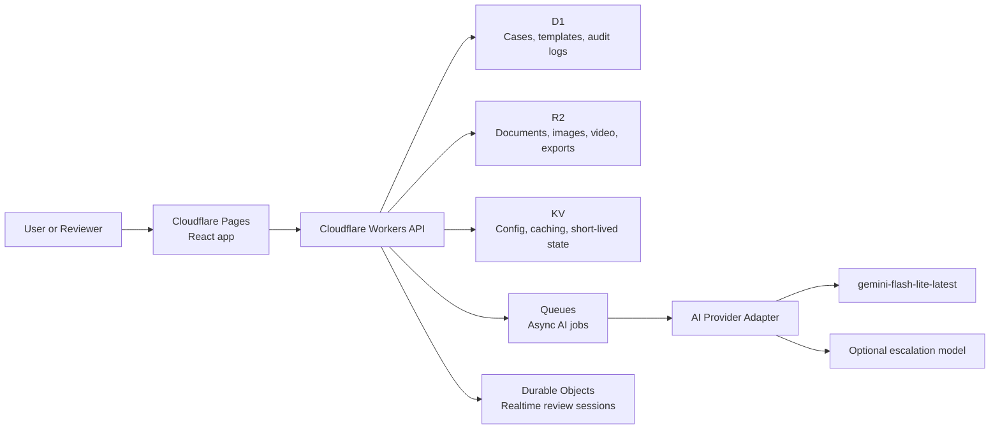

<div align="center">
  <h1>ResolveScope</h1>
  <p><strong>Evidence-to-action infrastructure for claims, safety, inspections, and quality workflows.</strong></p>
  <p>
    Turn scattered documents, photos, videos, and notes into structured case files,
    reviewable decisions, and export-ready reports.
  </p>

  <p>
    
    
    
    
  </p>
</div>

---

## Overview

ResolveScope is a product concept for teams that need to turn messy operational evidence into clearer, more structured, more reviewable outcomes.

Rather than forcing work across inboxes, PDFs, shared drives, spreadsheets, chat threads, and point tools, the idea is to bring everything into a single case-centered workspace that could support:

- evidence intake across documents, images, video, and notes
- AI-assisted summarization, extraction, and classification
- reviewer approval flows with audit history
- spatial and 360° annotation for field and inspection workflows
- PDF and JSON exports for downstream systems and stakeholders

The concept is aimed at workflows where decisions need to be **fast**, **consistent**, and **defensible**.

---

## Quick Links

- [Why this exists](#why-this-exists)
- [What makes ResolveScope different](#what-makes-resolvescope-different)
- [Primary workflows](#primary-workflows)
- [Example workflow](#example-workflow)
- [Illustrative capabilities](#illustrative-capabilities)
- [Template system](#template-system)
- [Possible architecture](#possible-architecture)
- [Suggested stack direction](#suggested-stack-direction)
- [Example local setup](#example-local-setup)
- [Demo story](#demo-story)
- [Roadmap](#roadmap)
- [Security and trust](#security-and-trust)

---

## Why this exists

Operational teams repeatedly face the same failure mode:

> important decisions are made from scattered, unstructured evidence.

That creates predictable problems:

- inconsistent evidence capture
- slow handoffs between submitters and reviewers
- repetitive summarization and report-writing work
- poor visibility into what evidence supports a decision
- weak audit trails for compliance, quality, and operational review
- limited spatial context when flat photos are the only review surface

ResolveScope addresses this by turning raw evidence into **decision-ready case files**.

---

## What makes ResolveScope different

ResolveScope is not a generic chatbot and not just a file uploader.

It is better thought of as a full workflow layer that could combine:

1. **Evidence intake** across PDFs, notes, photos, and video
2. **AI-assisted extraction** into structured fields, timelines, summaries, and actions
3. **Human-in-the-loop review** before outputs become final
4. **Spatial review** through 360° or lightweight 3D annotation
5. **Export-ready outputs** for reporting, compliance, and downstream handoff

### Positioning at a glance

| Traditional approach | Limitation | ResolveScope approach |
|---|---|---|
| Shared drives + email threads | Evidence is hard to trace and easy to lose | Centralized case workspace with linked evidence |
| Static forms and manual reports | Slow, repetitive, inconsistent | AI-assisted extraction and report generation |
| Flat image review | Weak spatial context | 360° and spatial annotation workflows |
| One-shot AI summaries | Hard to trust and hard to verify | Review, edits, approvals, and provenance |
| Single-purpose point tools | Fragmented handoffs | End-to-end evidence-to-action flow |

---

## Primary workflows

ResolveScope is intentionally framed as template-driven so the same product surface can flex across multiple operational domains.

| Workflow | What ResolveScope helps with |
|---|---|
| **Claims and incident review** | Upload evidence, summarize events, classify severity, and generate review-ready reports |
| **Fleet and safety operations** | Standardize incident intake, track evidence, and accelerate escalation workflows |
| **Site inspections** | Convert photos and notes into structured findings, annotations, and remediation reports |
| **Quality defect review** | Document visible issues, assign severity, and preserve an audit trail |
| **Field observations / punch lists** | Capture issues in context, attach supporting evidence, and coordinate follow-up actions |

---

## Example workflow

| Stage | What happens | Output |
|---|---|---|
| **1. Create a case** | A reviewer or submitter starts from a template such as Auto Claim Review or Site Inspection | Structured case shell with required fields |
| **2. Add evidence** | Users upload PDFs, photos, videos, and notes | Organized evidence library with preserved provenance |
| **3. Run AI extraction** | The system summarizes documents, extracts entities, builds timelines, and suggests severity or next steps | Reviewer-ready draft case brief |
| **4. Review and approve** | Humans validate AI outputs, edit structured fields, and sign off | Auditable approval record |
| **5. Export and share** | The case is converted into stakeholder-friendly artifacts | PDF report, JSON bundle, shareable read-only view |

---

## Illustrative capabilities

### Case workspace

- create and manage cases by template
- assign status, priority, severity, and ownership
- view evidence, extracted outputs, and case history on a single timeline
- preserve structured outputs alongside raw source material

### Evidence library

- upload PDFs, images, videos, and freeform notes
- organize evidence by type and case association
- preserve originals in object storage
- maintain source linkage between extracted fields and underlying artifacts

### AI summarization and analysis

- summarize long documents into concise case briefs
- extract entities, dates, timelines, defects, and action items
- classify severity using template-specific logic
- produce reviewer-friendly summaries for fast triage

### 360° / spatial review

- review evidence in a 360° viewer or lightweight 3D scene
- place pins and annotations on asset zones
- link annotations back to evidence items and observations
- compare revisions or before/after states over time

### Human review and approval

- inspect AI-generated fields before finalization
- edit structured outputs with explicit audit history
- approve summaries, severity, and recommended actions
- support role-based workflows for submitters, reviewers, and stakeholders

### Reporting and export

- generate polished PDF reports
- export JSON case bundles for downstream systems
- create shareable read-only links for external stakeholders
- preserve evidence-backed outputs for compliance and audit use cases

---

## Template system

ResolveScope is better framed as configurable by workflow template rather than locked to a single industry.

### Example templates

| Template | Typical inputs | Typical outputs |
|---|---|---|
| **Auto Claim Review** | photos, documents, claim notes | case brief, severity, report export |
| **Fleet Safety Incident** | driver notes, images, video, forms | incident summary, timeline, follow-up actions |
| **Site Inspection Report** | photos, inspection notes, plans | findings list, pinned issues, remediation summary |
| **Quality Defect Review** | product images, issue notes, references | defect summary, severity, export package |
| **Field Observation / Punch List** | observation notes, images, location context | task list, annotations, stakeholder report |

### What each template could define

- required evidence types
- extraction schema
- severity rules
- review checklist
- export format
- approval requirements

---

## Product principles

A strong version of ResolveScope would likely follow a few explicit product rules:

- **evidence first** — raw evidence remains visible and linked, not hidden behind AI output
- **human approval required** — important outputs stay reviewable and editable
- **structured by default** — summaries are useful, but structured fields drive action
- **template-driven workflows** — the platform adapts to different use cases without becoming generic
- **deployable architecture** — the system is designed to look and behave like a real internal product, not a demo-only prototype

---

## Possible architecture

### One possible high-level flow



### Possible architecture goals

- fast initial case load
- non-blocking AI analysis through queued jobs
- clear separation between raw evidence, structured outputs, and audit history
- realtime collaboration where coordinated review matters
- clean deployment path on a Cloudflare-native stack

---

## Possible data model

### Core entities

- `users`
- `organizations`
- `projects`
- `case_templates`
- `cases`
- `case_events`
- `evidence_items`
- `document_chunks`
- `image_annotations`
- `spatial_markers`
- `ai_runs`
- `review_actions`
- `exports`
- `audit_logs`

### Relationship model

| Entity | Relationship |
|---|---|
| `cases` | belong to a template and contain many evidence items |
| `evidence_items` | can produce multiple AI runs and reviewer annotations |
| `image_annotations` / `spatial_markers` | point back to evidence and asset regions |
| `review_actions` | create an auditable history of changes and approvals |
| `exports` | preserve final outputs and distribution artifacts |

---

## Suggested stack direction

### Frontend

- **React**
- **TypeScript**
- **Tailwind CSS**
- **React Three Fiber / Three.js** for 360° and lightweight 3D review
- **TanStack Query** for data fetching and sync
- **Zustand** or **React Context** for local workflow state

### Platform direction

- **Cloudflare Workers** for the API layer
- **Cloudflare Pages** for frontend hosting
- **Cloudflare D1** for relational case data
- **Cloudflare R2** for document, image, and video storage
- **Cloudflare Queues** for asynchronous AI processing jobs
- **Cloudflare Durable Objects** for realtime coordinated review sessions
- **Cloudflare KV** for lightweight config, caching, and short-lived state
- **Cloudflare Images** *(optional)* for image optimization and delivery
- **Cloudflare Turnstile** *(optional)* for abuse prevention on public forms

### AI direction

- **`gemini-flash-lite-latest`** as a lightweight default candidate for summarization, extraction, classification, and short-form analysis
- a provider-agnostic model adapter so the AI layer can be swapped or rerouted later
- an optional escalation path to a stronger model for harder reasoning or higher-risk review tasks

### Developer tooling

- **npm**
- **Vite**
- **Wrangler**
- **ESLint**
- **Prettier**
- **Vitest**
- **Playwright**

---

## AI model direction

A sensible default for the concept is:

> use the smallest reliable model for the highest-volume work, while preserving the option to swap models later.

That keeps latency lower and costs more predictable for workloads such as:

- document summarization
- metadata extraction
- incident classification
- photo captioning and observation generation
- checklist completion assistance
- short recommendation drafting

### Example routing model

| Lane | Model behavior | Example tasks |
|---|---|---|
| **Fast lane** | Lowest-cost, highest-throughput | summarization, extraction, tagging |
| **Review lane** | Same model with stricter schema checks | structured outputs, confidence thresholds |
| **Escalation lane** | Stronger model when ambiguity is high | difficult reasoning, complex review edge cases |

The goal is to keep the MVP fast, affordable, and operationally simple without overcommitting the product to a single provider decision too early.

---

## Example repository structure

```text
resolvescope/
├─ apps/
│  ├─ web/                  # React frontend
│  └─ worker/               # Cloudflare Workers API
├─ packages/
│  ├─ ui/                   # Shared UI components
│  ├─ schemas/              # Zod schemas / shared types
│  ├─ ai/                   # Model adapters, prompts, routing
│  ├─ spatial/              # 360° viewer and annotation utilities
│  ├─ exports/              # PDF/JSON export logic
│  └─ templates/            # Case template definitions
├─ docs/
│  ├─ architecture/
│  ├─ prompts/
│  ├─ api/
│  └─ screenshots/
├─ scripts/
├─ migrations/
├─ public/
└─ README.md
```

---

## Example local setup

### Prerequisites for one possible setup

- Node.js 20+
- npm
- Wrangler
- Cloudflare account
- AI provider API key(s)

### Example environment variables

```bash
CLOUDFLARE_ACCOUNT_ID=
CLOUDFLARE_API_TOKEN=
D1_DATABASE_ID=
R2_BUCKET=
KV_NAMESPACE_ID=
AI_PROVIDER=
GEMINI_API_KEY=
```

### Install dependencies

```bash
npm install
```

### Run the frontend

```bash
npm run dev --workspace apps/web
```

### Run the Worker locally

```bash
npm run dev --workspace apps/worker
```

### Run tests

```bash
npm test
```

---

## Deployment

### Frontend

Deploy the React application to **Cloudflare Pages**.

### API

Deploy the backend to **Cloudflare Workers**.

### Storage and state

Provision:

- **D1** for relational case state
- **R2** for file and export storage
- **KV** for low-latency config and cache
- **Queues** for asynchronous job execution
- **Durable Objects** for realtime collaboration

### Production checklist

- configure environment secrets
- create database migrations
- provision the R2 bucket and access bindings
- configure queues and consumers
- configure Pages and Workers routes
- attach a custom domain
- enable DNSSEC
- add analytics, logs, and alerts

---

## Demo story

This project is strongest when shown as a short end-to-end workflow rather than a static feature list.

### Suggested demo flow

1. Open a seeded case template
2. Upload or load existing evidence
3. Show AI-generated summary, extracted timeline, and structured fields
4. Review and edit outputs in a human approval step
5. Open the spatial review surface and place an annotation
6. Export a polished report

### Best seeded demo cases

- a vehicle or fleet incident
- a field inspection walkthrough
- a product or quality defect review

This creates a fast “input → extraction → approval → export” loop that reads well to judges, recruiters, and engineering reviewers.

---

## Visual assets to add

To make the repository page even stronger once the product UI exists, add these files under `docs/screenshots/` and reference them here:

- `dashboard-overview.png`
- `case-workspace.png`
- `spatial-review.png`
- `export-preview.png`
- `demo-flow.gif`

### Recommended screenshot order

| Asset | What it should show |
|---|---|
| **Dashboard overview** | case list, status, priority, and recent activity |
| **Case workspace** | evidence panel, structured summary, reviewer controls |
| **Spatial review** | annotations placed in a 360° or lightweight 3D context |
| **Export preview** | polished PDF output or structured JSON bundle |
| **Demo GIF** | the complete evidence-to-action loop in under 20 seconds |

---

## Cloudflare domains

If the project ships on Cloudflare, it could deploy via a Pages preview URL or a custom domain.

### Default preview deployment

- `<project-name>.pages.dev`

### Possible production domain patterns

- `resolvescope.app`
- `resolvescope.dev`
- `resolvescope.ai`
- `getresolvescope.com`
- `tryresolvescope.com`
- `resolvescopehq.com`

> Domain availability changes over time and should be confirmed before registration.

---

## MVP scope

A strong first public version would likely focus on:

- one strong case workspace
- evidence upload and organization
- document and media summarization
- structured extraction into a case schema
- human review and edit flow
- one spatial annotation module
- PDF and JSON export
- seeded demo cases for evaluation and showcase use

### Stretch goals

- multi-user live review rooms
- annotation version history
- evidence-to-field provenance view
- template builder UI
- before/after comparisons
- cross-case similarity search
- webhook or API integrations
- admin analytics for throughput and review quality

### Cut list if time slips

- live collaboration
- cross-case similarity search
- advanced analytics
- multi-template builder UI
- optional stronger-model escalation

---

## Security and trust

The product should feel credible in environments where evidence quality and decision traceability matter.

### Security goals

- least-privilege access patterns
- signed upload flows
- audit logs for sensitive actions
- immutable evidence references where appropriate
- secure secret management
- schema validation on all structured AI outputs

### AI trust goals

- human approval before finalization
- confidence-aware extraction pipelines
- template-specific validation
- explainable source-to-output linking
- model routing based on task complexity and cost

---

## Performance goals

- fast initial case load
- sub-second navigation for cached case views
- non-blocking AI analysis through queue-backed jobs
- progressive evidence rendering for image-heavy cases
- responsive spatial review on laptop-class hardware

---

## Open-source goals

The repository should be understandable, extensible, and production-minded.

### Priorities

- clean monorepo structure
- readable infrastructure configuration
- well-defined schemas and interfaces
- documented AI routing strategy
- reproducible local development setup
- clear separation between product logic and provider-specific integrations

---

## Roadmap

### Phase 1

- core case workspace
- evidence management
- AI summaries and extraction
- reviewer approval flow

### Phase 2

- spatial annotation module
- export system
- seeded showcase demo

### Phase 3

- live collaboration
- provenance UI
- admin analytics
- external integrations

---

## Positioning

ResolveScope is intended for teams that need more than storage, more than chat, and more than a static report.

It is the operational layer between **raw evidence** and **clear action**.

---

## Status

Early-stage build in active development.

---

## License

MIT
