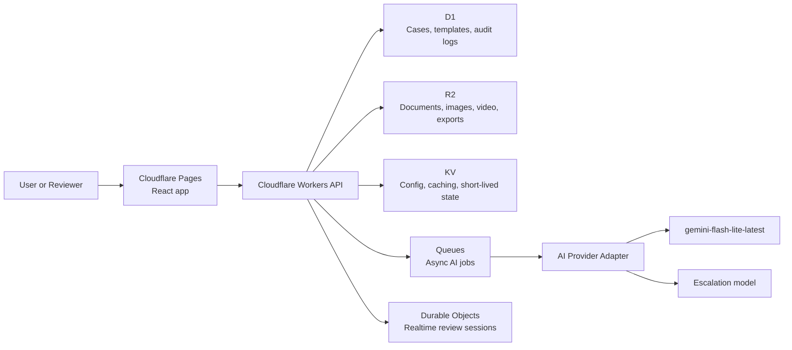

<div align="center">
  <h1>ResolveScope</h1>
  <p><strong>Evidence-to-action infrastructure for claims, safety, inspections, and quality workflows.</strong></p>
  <p>
    Turn scattered documents, photos, videos, and notes into structured case files,
    reviewable decisions, and export-ready reports.
  </p>

  <p>
    <a href="https://resolvescope.pages.dev"><strong>resolvescope.pages.dev →</strong></a>
  </p>

  <p>
    
    
    
    
  </p>
</div>

---

## Live demo

**[https://resolvescope.pages.dev](https://resolvescope.pages.dev)**

Deployed on Cloudflare Pages. No login required for the demo surfaces.

### Demo surfaces

| Route | What you see |
|---|---|
| [`/`](https://resolvescope.pages.dev/) | Landing page — product overview and value proposition |
| [`/dashboard`](https://resolvescope.pages.dev/dashboard) | Case dashboard — seeded case list with status, priority, and type |
| [`/demo/auto-claim`](https://resolvescope.pages.dev/demo/auto-claim) | Auto claim case workspace — evidence, AI extraction, spatial review |
| [`/demo/fleet-safety`](https://resolvescope.pages.dev/demo/fleet-safety) | Fleet safety incident workspace |
| [`/demo/site-inspection`](https://resolvescope.pages.dev/demo/site-inspection) | Site inspection workspace — field observations, findings, annotations |
| [`/report/auto-claim`](https://resolvescope.pages.dev/report/auto-claim) | Stakeholder report — formatted case brief for external review |
| [`/report/fleet-safety`](https://resolvescope.pages.dev/report/fleet-safety) | Fleet safety stakeholder report |
| [`/report/site-inspection`](https://resolvescope.pages.dev/report/site-inspection) | Site inspection stakeholder report |
| [`/architecture`](https://resolvescope.pages.dev/architecture) | Architecture page — system design, data model, stack overview |

### Suggested reviewer flow

1. **[Landing](https://resolvescope.pages.dev/)** — read the product framing and workflow overview
2. **[Dashboard](https://resolvescope.pages.dev/dashboard)** — browse the seeded case list
3. **[Auto Claim workspace](https://resolvescope.pages.dev/demo/auto-claim)** — open a case, review evidence, structured AI extraction, and spatial annotation
4. **[Stakeholder report](https://resolvescope.pages.dev/report/auto-claim)** — see the export-ready case brief generated from the same data
5. **[Architecture](https://resolvescope.pages.dev/architecture)** — review the system design and stack decisions

---

## What it is

ResolveScope is an evidence-to-action platform for operational teams that need structured, reviewable, defensible outcomes from messy real-world evidence.

Instead of inboxes, shared drives, PDFs, and chat threads, everything comes into a single case-centered workspace:

- **Evidence intake** across documents, images, video, and notes
- **AI-assisted extraction** into structured fields, timelines, summaries, and actions
- **Human-in-the-loop review** — nothing becomes final without approval
- **Spatial and 360° annotation** for field and inspection workflows
- **Export-ready outputs** — PDF reports, JSON bundles, and shareable read-only views

The platform is template-driven, so the same product surface applies across claims, fleet safety incidents, site inspections, quality defect reviews, and field observations.

---

## Why it matters

Operational teams face the same failure mode repeatedly:

> Important decisions are made from scattered, unstructured evidence.

That creates predictable problems:

- inconsistent evidence capture across teams and cases
- slow handoffs between submitters and reviewers
- repetitive, error-prone summarization and report writing
- poor visibility into what evidence supports a decision
- weak audit trails for compliance, quality, and operational review
- limited spatial context when flat photos are the only review surface

ResolveScope addresses this by turning raw evidence into **decision-ready case files**.

---

## What makes it different

| Traditional approach | Limitation | ResolveScope approach |
|---|---|---|
| Shared drives + email threads | Evidence is hard to trace and easy to lose | Centralized case workspace with linked evidence |
| Static forms and manual reports | Slow, repetitive, inconsistent | AI-assisted extraction and report generation |
| Flat image review | Weak spatial context | 360° and spatial annotation workflows |
| One-shot AI summaries | Hard to trust and hard to verify | Review, edits, approvals, and provenance |
| Single-purpose point tools | Fragmented handoffs | End-to-end evidence-to-action flow |

---

## Workflows

ResolveScope ships with seeded templates for:

| Template | What it covers |
|---|---|
| **Auto Claim Review** | Vehicle damage evidence, severity triage, claim-ready report |
| **Fleet Safety Incident** | Driver incident intake, evidence review, escalation workflow |
| **Site Inspection** | Field observations, photo annotations, punch list and remediation summary |

The same structured intake → AI extraction → human review → export loop applies across all templates.

---

## Stack

### Frontend

- React 19 + TypeScript
- React Router v7
- Custom CSS
- React Three Fiber / Three.js — 360° and lightweight 3D spatial review

### Platform

- Cloudflare Pages — frontend hosting (live at `resolvescope.pages.dev`)
- Cloudflare Workers — API layer (architectural direction)
- Cloudflare D1 — relational case data
- Cloudflare R2 — document, image, and video storage
- Cloudflare Queues — asynchronous AI job processing
- Cloudflare Durable Objects — realtime coordinated review sessions

### AI

- `gemini-flash-lite-latest` as the default summarization and extraction model
- Provider-agnostic adapter designed for model swapping and cost routing
- Optional escalation path for higher-complexity review tasks

### Tooling

- npm workspaces monorepo
- Vite
- Wrangler
- TypeScript strict mode

---

## Architecture

The system is designed around a clear separation between raw evidence, structured outputs, and audit history.



See the [architecture page](https://resolvescope.pages.dev/architecture) for the full system overview.

---

## Local setup

### Prerequisites

- Node.js 20+
- npm 10+

### Install

```bash
npm install
```

### Run the frontend

```bash
npm run dev:web
```

### Build all workspaces

```bash
npm run build
```

### Type check

```bash
npm run typecheck
```

---

## Deployment

The frontend is deployed to Cloudflare Pages and live at **[resolvescope.pages.dev](https://resolvescope.pages.dev)**.

The Workers API, D1, R2, Queues, and Durable Objects layers are part of the architectural direction — the demo runs on seeded frontend data.

---

## Product principles

- **Evidence first** — raw evidence remains visible and linked, not hidden behind AI output
- **Human approval required** — important outputs stay reviewable and editable before finalization
- **Structured by default** — summaries are useful, but structured fields drive action
- **Template-driven workflows** — the platform adapts across domains without becoming generic
- **Deployable architecture** — designed to look and behave like a real internal product

---

## Security and trust goals

- Least-privilege access patterns
- Signed upload flows
- Audit logs for sensitive actions
- Schema validation on all structured AI outputs
- Human approval before any AI-generated field becomes final
- Model routing based on task complexity and confidence

---

## License

MIT
